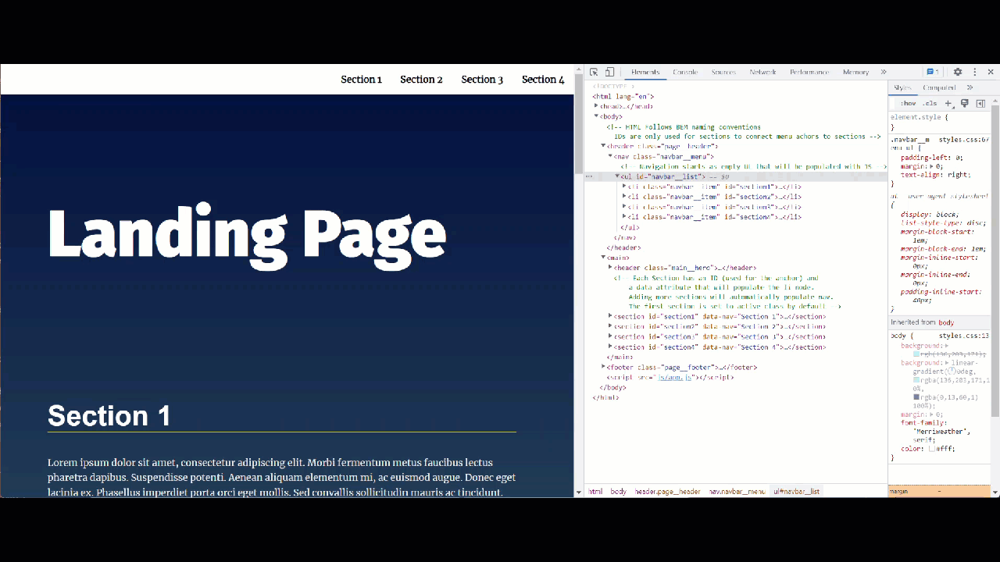
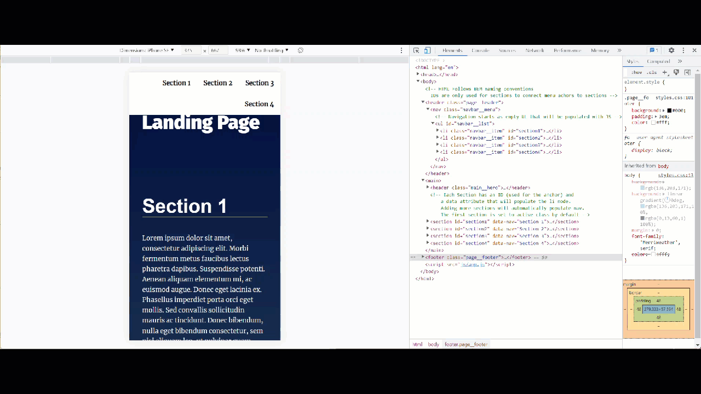

# Project 2: Landing Page
__Udacity Front End Developer Nanodegree Program__

Project 2 requires the building of a mulit-section landing page that contains a dynamically updating navigation menu that is created dynamically from the number of sections in the page.

# Example Screenshots




# Table of Contents
- [Project 2: Landing Page](#project-2-landing-page)
- [Example Screenshots](#example-screenshots)
- [Table of Contents](#table-of-contents)
- [Instructions](#instructions)
- [Installation](#installation)
- [Usage](#usage)
- [License](#license)

# Instructions
This project started form the [starter code](https://github.com/udacity/fend/tree/refresh-2019/projects/landing-page) that contained a template for a static landing page.  Modifications were made to the HTML, CSS files to add secitions and styles, and a javascript file was written to create a dynamic navigation experirence as seen in the screenshots.

# Installation
To install the code, use `git clone` to copy the repo locally.  Alternatively you can download the files from this repository.

# Usage
To view the completed webpage, open `index.html` in a browser.  To make modifications, use the text editor of choice.  For this project I used VS Code.  The directory structure is as follows:

```
-css            directory for stylesheets
---sytles.css   css sytlesheet
-js             directory for javascript
---app.js       javascript for the landing page
index.html      HTML file of the landing page
LICENSE         MIT license file
README.md       This document you are reading
```

# License
MIT License - Copyright (c) 2022 Stuart Kozola